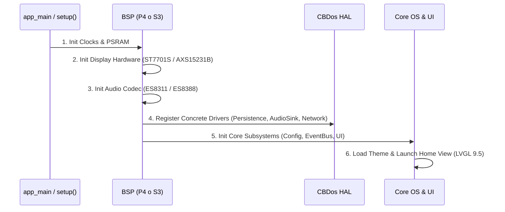

# 🏛️ Especificación Maestra de Arquitectura de CBDos (Core / HAL / BSP)

## 📌 1. Filosofía y Principios de Diseño

**CBDos** es un sistema operativo embebido multi-target diseñado bajo el principio de **desacoplamiento total del hardware**. El 90% del software (interfaz gráfica LVGL 9.5, lógica de aplicaciones, motor de scripting Lua, decodificadores de audio Helix y servicios del sistema) reside en un núcleo (`core/`) que es **100% agnóstico a la plataforma**.

```
┌─────────────────────────────────────────────────────────────────────────┐
│                      CAPA DE APLICACIÓN (LVGL 9.5)                      │
│   RadioView   •   FileManagerView   •   MusicPlayer   •   SettingsView  │
└────────────────────────────────────┬────────────────────────────────────┘
                                     │ (Consume Servicios y Eventos)
┌────────────────────────────────────▼────────────────────────────────────┐
│                           CORE SERVICES & LOGIC                         │
│  • ConfigManager (usa IPersistence)    • AudioPipeline (usa IAudioSink) │
│  • EventBus (Pub/Sub desacoplado)      • FileOperationsService          │
│  • Decodificadores (Helix MP3/AAC/WAV) • LuaEngine                      │
└────────────────────────────────────┬────────────────────────────────────┘
                                     │ (Interfaces Abstractas C++ HAL)
                                     ▼
                      ┌───────────────────────────────┐
                      │    CBDOS HAL (Contratos)      │
                      │  • IPersistenceBackend        │
                      │  • IAudioSink                 │
                      │  • INetworkAdapter            │
                      │  • IDisplayDriver             │
                      └──────────────┬────────────────┘
                                     │
             ┌───────────────────────┴───────────────────────┐
             ▼                                               ▼
┌─────────────────────────────┐               ┌─────────────────────────────┐
│    BSP ESP32-P4 (ESP-IDF)   │               │   BSP ESP32-S3 (PlatformIO) │
│ • nvs_flash Driver          │               │ • Preferences Driver        │
│ • ES8311 I2S Sink           │               │ • Arduino I2S Audio Sink    │
│ • C6 SDIO Hosted Network    │               │ • Native WiFi Adapter       │
│ • MIPI-DPI ST7701S Driver   │               │ • QSPI AXS15231B Driver     │
└─────────────────────────────┘               └─────────────────────────────┘
```

---

## 🚫 2. Ley de Pureza Arquitectónica de `core/` (Zero Platform Pollution)

1. **Agnosticismo Estricto de `core/`:**
   * `core/` DEBE ser código C++ estándar (C++17/20) y LVGL 9.5 puro.
   * **PROHIBIDO** incluir headers de plataformas (`<Arduino.h>`, `<Preferences.h>`, `<SD.h>`, `<driver/...>`, `<esp_...>` directos de hardware).
   * **PROHIBIDO** bifurcar la lógica de negocio mediante `#ifdef ARDUINO` o `#ifdef ESP_PLATFORM` dentro de `core/`.

2. **Inyección de Dependencias en el Arranque:**
   * Las interfaces son declaradas en `core/include/cbdos/`.
   * Los Board Support Packages (`bsp/`) implementan los contratos y los registran en el arranque del sistema (`app_main` o `setup()`).

3. **Filosofía Offline-First:**
   * La UI, audio, almacenamiento y emuladores deben inicializarse y funcionar sin requerir conexión a internet ni la presencia obligatoria de coprocesadores de red.

---

## 📐 3. Contratos de la Capa de Abstracción de Hardware (HAL)

### 3.1. Persistencia y NVS (`IPersistenceBackend`)
Desacopla el almacenamiento clave-valor para evitar dependencias cruzadas entre `Preferences.h` de Arduino y `nvs_flash.h` de ESP-IDF.

```cpp
// core/include/cbdos/persistence.hpp
#pragma once
#include <string>
#include <cstdint>

namespace cbdos {
namespace persistence {

class IPersistenceBackend {
public:
    virtual ~IPersistenceBackend() = default;

    virtual bool begin(const char* nameSpace, bool readOnly = false) = 0;
    virtual void end() = 0;
    virtual bool clear() = 0;

    virtual bool setUChar(const char* key, uint8_t value) = 0;
    virtual uint8_t getUChar(const char* key, uint8_t defaultValue = 0) = 0;

    virtual bool setInt(const char* key, int32_t value) = 0;
    virtual int32_t getInt(const char* key, int32_t defaultValue = 0) = 0;

    virtual bool setUInt(const char* key, uint32_t value) = 0;
    virtual uint32_t getUInt(const char* key, uint32_t defaultValue = 0) = 0;

    virtual bool setBool(const char* key, bool value) = 0;
    virtual bool getBool(const char* key, bool defaultValue = false) = 0;

    virtual bool setString(const char* key, const std::string& value) = 0;
    virtual std::string getString(const char* key, const std::string& defaultValue = "") = 0;
};

void setBackend(IPersistenceBackend* backend);
IPersistenceBackend* getBackend();

} // namespace persistence
} // namespace cbdos
```

---

### 3.2. Pipeline de Audio (`IAudioSink` y `IAudioDecoder`)
Separa el hardware de salida (I2S/DAC) de los algoritmos de decodificación de audio comprimido.

```cpp
// core/include/cbdos/audio_sink.hpp
#pragma once
#include <cstdint>
#include <cstddef>

namespace cbdos {
namespace audio {

class IAudioSink {
public:
    virtual ~IAudioSink() = default;

    virtual bool init(uint32_t sampleRate, uint8_t channels, uint8_t bitsPerSample) = 0;
    virtual size_t write(const int16_t* pcmSamples, size_t sampleCount) = 0;
    virtual void setVolume(uint8_t volumePercent) = 0;
    virtual void mute(bool enable) = 0;
    virtual void deinit() = 0;
};

} // namespace audio
} // namespace cbdos
```

```cpp
// core/src/audio/decoders/IAudioDecoder.hpp
#pragma once
#include <cstdint>
#include <cstddef>

namespace cbdos {
namespace audio {

enum class CodecType { MP3, AAC, WAV, Unknown };

class IAudioDecoder {
public:
    virtual ~IAudioDecoder() = default;

    virtual bool open(const char* path) = 0;
    virtual bool decodeFrame(int16_t* outPcm, size_t maxSamples, size_t& samplesDecoded) = 0;
    virtual bool seekMs(uint32_t ms) = 0;
    virtual uint32_t getDurationMs() const = 0;
    virtual uint32_t getPositionMs() const = 0;
    virtual void close() = 0;
};

} // namespace audio
} // namespace cbdos
```

---

### 3.3. Adaptador de Red (`INetworkAdapter`)
Estandariza la conectividad ya sea nativa (ESP32-S3) o a través de coprocesador SDIO (ESP32-P4 + C6).

```cpp
// core/include/cbdos/network_adapter.hpp
#pragma once
#include <string>
#include <vector>

namespace cbdos {
namespace network {

struct AccessPoint {
    std::string ssid;
    int8_t rssi;
    uint8_t authmode;
};

enum class NetState {
    Disconnected,
    Connecting,
    Connected,
    Failed
};

class INetworkAdapter {
public:
    virtual ~INetworkAdapter() = default;

    virtual bool init() = 0;
    virtual bool scanAsync() = 0;
    virtual std::vector<AccessPoint> getScanResults() = 0;
    virtual bool connect(const std::string& ssid, const std::string& password) = 0;
    virtual bool disconnect() = 0;
    virtual NetState getState() const = 0;
    virtual std::string getIpAddress() const = 0;
};

} // namespace network
} // namespace cbdos
```

---

### 3.4. Bus de Eventos Reactivo (`EventBus`)
Elimina la necesidad de variables globales estáticas en las vistas de UI y el acoplamiento directo con tareas de FreeRTOS.

```cpp
// core/include/cbdos/event_bus.hpp
#pragma once
#include <cstdint>
#include <functional>
#include <unordered_map>
#include <vector>

namespace cbdos {

enum class EventId : uint16_t {
    // Sistema
    LowMemory,
    BatteryChanged,
    BrightnessChanged,
    VolumeChanged,

    // Conectividad
    WifiConnected,
    WifiDisconnected,
    WifiScanCompleted,

    // Almacenamiento
    SdCardMounted,
    SdCardUnmounted,

    // Audio
    AudioTrackChanged,
    AudioTrackFinished,
    RadioBuffering,
    RadioPlaying
};

struct EventData {
    EventId id;
    int32_t param1 = 0;
    int32_t param2 = 0;
    void* ptr = nullptr;
};

using EventCallback = std::function<void(const EventData&)>;

class EventBus {
public:
    static EventBus& getInstance();

    uint32_t subscribe(EventId id, EventCallback callback);
    void unsubscribe(uint32_t subscriptionId);
    void post(const EventData& event);
    void processQueue(); // Llamado desde el loop principal de UI
};

} // namespace cbdos
```

---

### 3.5. Ciclo de Vida de Aplicaciones Nativas (`INativeApp`)
Estandariza la ejecución de emuladores y launchers sin hackear la memoria de LVGL.

```cpp
// core/include/cbdos/native_app.hpp
#pragma once

namespace cbdos {

class INativeApp {
public:
    virtual ~INativeApp() = default;

    virtual bool onPrepare() = 0; // Verifica requerimientos de RAM / ROM
    virtual void onSuspendOS() = 0; // Pausa el render de LVGL y cede recursos
    virtual void onRun() = 0;       // Loop principal exclusivo
    virtual void onResumeOS() = 0;  // Restaura la UI de LVGL y el estado del sistema
};

} // namespace cbdos
```

---

## 🔄 4. Flujo de Inicialización Multi-Target (Boot Flow)



---

## 📁 5. Estructura de Directorios Definitiva

```
cbdos/
├── core/                                # 100% Agnóstico (C++17 + LVGL 9.5)
│   ├── include/cbdos/                   # Contratos de interfaces abstractas
│   │   ├── persistence.hpp              # IPersistenceBackend
│   │   ├── audio_sink.hpp               # IAudioSink
│   │   ├── network_adapter.hpp          # INetworkAdapter
│   │   ├── event_bus.hpp                # EventBus & EventId
│   │   ├── native_app.hpp               # INativeApp Lifecycle
│   │   ├── display.hpp                  # Display Capabilities & API
│   │   └── storage.hpp                  # Storage abstraction
│   ├── src/
│   │   ├── system/                      # ConfigManager, EventBus, Services
│   │   ├── audio/                       # Decoders (MP3/AAC/WAV), HttpStreamer
│   │   ├── ui/                          # LVGL Views, Modals, Components, Themes
│   │   ├── lua/                         # Lua Engine & Modular Bindings
│   │   └── fs/                          # FileOperationsService
│   └── CMakeLists.txt
│
├── bsp/                                 # Drivers y Soporte de Hardware
│   ├── esp32_p4_jc4880/                 # ESP32-P4 (ESP-IDF 5.5)
│   │   ├── hal/                         # EspIdfNvsBackend, ES8311AudioSink, etc.
│   │   ├── drivers/                     # ST7701S MIPI DPI, GT911 Touch
│   │   └── main/main_p4.cpp
│   │
│   ├── esp32_s3_jc3248/                 # ESP32-S3 (PlatformIO + Arduino)
│   │   ├── hal/                         # PreferencesBackend, ArduinoAudioSink
│   │   ├── src/                         # AXS15231B Display/Touch Driver
│   │   └── src/main_s3.cpp
│   │
│   └── pc_simulator/                    # Simulador PC (SDL2)
│       └── hal/                         # SdlAudioSink, JsonFilePersistence
│
└── docs/                                # Documentación de Arquitectura y Hardware
```
