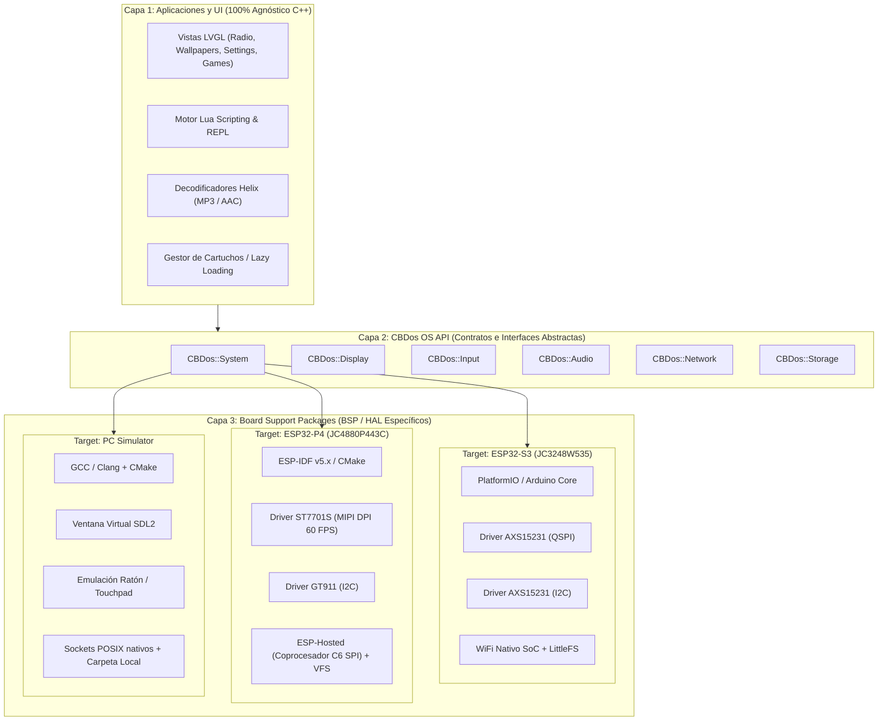

# Arquitectura Agnóstica y Modular de CBDos (Core / HAL / BSP)

## 1. Resumen Ejecutivo y Filosofía

El objetivo fundamental de esta arquitectura es convertir a **CBDos** en un sistema operativo embebido desacoplado del hardware físico subyacente. Esto permite que el 90% del software (aplicaciones, interfaz gráfica LVGL, motor de scripting Lua, decodificadores de audio, navegadores de archivos y lógica de red) sea **100% agnóstico y universal**, ejecutándose sin cambios en diferentes plataformas:

* **ESP32-S3** (entorno PlatformIO / Arduino Core, pantalla QSPI/SPI, WiFi SoC integrado).
* **ESP32-P4 + C6** (entorno nativo ESP-IDF v5.x, pantalla MIPI DPI 60 FPS, coprocesador inalámbrico por SDIO/SPI).
* **PC Simulator** (entorno SDL2 para desarrollo instantáneo en Linux/macOS/Windows sin necesidad de flashear hardware).

---

## 2. Analogía del Sistema: El Modelo del Automóvil

```
┌─────────────────────────────────────────────────────────────┐
│  CARROCERÍA Y CABINA (Apps, UI LVGL, Lua, Radio, Doom)      │  <- 100% Agnóstico
├─────────────────────────────────────────────────────────────┤
│  TABLERO / PEDALES (CBDos OS API & Contratos C++)           │  <- API Estándar
├─────────────────────────────────────────────────────────────┤
│  CHASIS Y MOTOR (HAL / BSP - Drivers específicos)           │
│  ├─ Motor 4 cil: ESP32-S3 (Arduino/PlatformIO + QSPI)       │  <- Intercambiable
│  ├─ Motor V8:    ESP32-P4 (ESP-IDF 5.x + MIPI DPI + C6)     │  <- Intercambiable
│  └─ Simulador:   PC x86_64 (SDL2 + FreeRTOS Sim / POSIX)    │  <- Intercambiable
└─────────────────────────────────────────────────────────────┘
```

* **La Cabina (Capa de Aplicaciones):** Al conductor solo le importa acelerar, frenar y ver el velocímetro. La aplicación de Radio o el emulador no necesitan saber si el display es MIPI DPI o SPI, ni qué pines I2S usa el DAC de audio.
* **El Motor (Capa HAL/BSP):** Cada placa implementa los drivers de hardware específicos bajo una misma interfaz unificada.

---

## 3. ¿Por qué NO duplicar el desarrollo? (Análisis de Viabilidad)

| Criterio | Desarrollo Duplicado (Fork S3 vs P4) | Arquitectura Unificada (Core + HAL) |
| :--- | :--- | :--- |
| **Mantenimiento** | ❌ Crítico. Cada bugfix o nueva app debe escribirse y probarse dos veces. | ✅ Óptimo. Se escribe una vez y beneficia a todos los dispositivos. |
| **Divergencia de Código** | ❌ Alta. Con el tiempo, una de las plataformas quedará inevitablemente obsoleta y abandonada. | ✅ Nula. El motor de apps, Lua y UI siempre es el mismo. |
| **Tiempo de Desarrollo** | ❌ Se duplica el tiempo invertido en features de alto nivel. | ✅ Aceleración x2 en creación de apps y posibilidad de probar en PC. |
| **Aprovechamiento del Hardware** | ⚠️ Requiere escribir código no portable. | ✅ El Core consulta capacidades dinámicas (*Feature Flags*) como aceleración 2D o resolución. |

---

## 4. Diagrama de Arquitectura en 3 Capas



---

## 5. Diseño de Contratos de la API de CBDos

Las aplicaciones **nunca incluyen cabeceras directas de hardware** (`<Arduino.h>`, `<esp_lcd_...>`, `<driver/gpio.h>`). En su lugar, utilizan el espacio de nombres `CBDos::`:

### 5.1. Sistema y Memoria (`CBDos_System.h`)
```cpp
namespace CBDos::System {
    uint32_t getTimeMs();               // Tiempo en milisegundos
    void sleepMs(uint32_t ms);          // Delay no bloqueante / FreeRTOS delay
    size_t getFreeHeap();               // RAM interna libre
    size_t getFreePsram();              // PSRAM libre
    void restart();                     // Reinicio de software
    void log(LogLevel level, const char* tag, const char* fmt, ...);
}
```

### 5.2. Pantalla y Gráficos (`CBDos_Display.h`)
```cpp
struct DisplayCapabilities {
    uint16_t width;
    uint16_t height;
    bool hasHardware2D;                 // true en P4 (PPA/DMA2D), false en S3
    uint8_t targetFps;                  // 60 en P4, 30 en S3
};

namespace CBDos::Display {
    DisplayCapabilities getCapabilities();
    void setBrightness(uint8_t percent);
    void flushFrameBuffer(const void* buffer);
}
```

### 5.3. Pipeline de Audio (`CBDos_Audio.h`)
```cpp
namespace CBDos::Audio {
    bool playStream(const char* url);   // Streaming HTTP MP3/AAC
    bool playFile(const char* path);    // Reproducir desde SD / Flash
    void setVolume(uint8_t volPercent); // 0 - 100%
    void pause();
    void resume();
    AudioStats getStats();              // Tasa de bits, buffer status, etc.
}
```

### 5.4. Almacenamiento y Archivos (`CBDos_Storage.h`)
```cpp
namespace CBDos::Storage {
    bool mountSD();
    bool mountInternal();
    std::vector<std::string> listDirectory(const char* path);
    size_t getDiskFreeSpace(const char* path);
}
```

---

## 6. Detección Dinámica de Capacidades (*Feature Flags*)

Para aprovechar la potencia del **ESP32-P4** (pantalla de alta resolución, acelerador 2D PPA, coprocesador) sin romper la compatibilidad con el **ESP32-S3**, el código de alto nivel consulta las capacidades del dispositivo en tiempo de ejecución:

```cpp
void CartridgeView::renderTransition() {
    auto caps = CBDos::Display::getCapabilities();

    if (caps.hasHardware2D) {
        // Modo P4: Efectos visuales pesados a 60 FPS con aceleración de hardware
        applyComplexBlurAndScaling();
    } else {
        // Modo S3: Transición ligera de fade-in simple optimizada para CPU
        applySimpleFade();
    }
}
```

---

## 7. Estructura de Directorios Recomendada

```
CBDos-Project/
├── core/                                # 100% Agnóstico (C++ puro + LVGL)
│   ├── api/                             # Headers de la API unificada
│   │   ├── CBDos_System.h
│   │   ├── CBDos_Display.h
│   │   ├── CBDos_Audio.h
│   │   ├── CBDos_Network.h
│   │   └── CBDos_Storage.h
│   ├── ui/                              # Interfaz gráfica LVGL
│   │   ├── Views/ (Radio, Wallpapers, Settings, etc.)
│   │   └── Widgets/
│   ├── lua/                             # Motor Lua y Bindings agnósticos
│   └── audio/                           # Decodificadores Helix (MP3/AAC)
│
├── bsp/                                 # Board Support Packages (Hardware)
│   ├── esp32_p4_jc4880/                 # Implementación para ESP32-P4 (ESP-IDF)
│   │   ├── main/
│   │   ├── hal_display_p4.cpp           # ST7701S MIPI DPI
│   │   ├── hal_touch_p4.cpp             # GT911 I2C
│   │   ├── hal_audio_p4.cpp             # I2S ESP-IDF Driver
│   │   └── CMakeLists.txt
│   │
│   ├── esp32_s3_jc3248/                 # Implementación para ESP32-S3 (PlatformIO)
│   │   ├── src/
│   │   │   ├── hal_display_s3.cpp       # AXS15231 QSPI
│   │   │   └── hal_audio_s3.cpp         # I2S Arduino
│   │   └── platformio.ini
│   │
│   └── pc_simulator/                    # Implementación para PC (SDL2)
│       ├── main_sim.cpp                 # Ventana de depuración SDL2
│       └── CMakeLists.txt
│
└── docs/                                # Documentación de arquitectura
```

---

## 8. Roadmap de Transición Progresiva

1. **Fase 1 (Completada):** Estabilizar el puerto de hardware del ESP32-P4 (Display MIPI DPI 60 FPS, Touch GT911 y decodificación de audio básica).
2. **Fase 2 (Abstracción de Headers):** Reemplazar progresivamente las cabeceras temporales (`Arduino.h`, `WiFi.h`, `SD.h`) por las cabeceras definitivas de la API `CBDos_*.h`.
3. **Fase 3 (Modularización Core / BSP):** Mover el código de la UI, Lua y Audio a la carpeta `core/` para que sea consumible como submódulo o componente compartido por cualquier target.
4. **Fase 4 (Simulador PC):** Habilitar el target SDL2 para iterar sobre diseños de UI en segundos directamente en el entorno de desarrollo.
