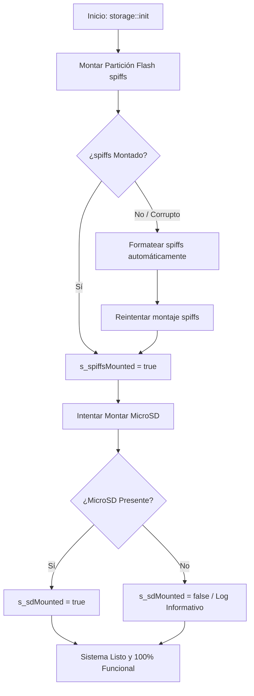

# 📋 Especificación Técnica Detallada: Refactorización de la Capa de Almacenamiento (Fase 2)
### *Almacenamiento VFS Flash (SPIFFS) + MicroSD Portable + Persistencia MessagePack de Datos de Aplicación*

---

## 📌 1. Resumen Ejecutivo y Diagnóstico

### 1.1. Contexto tras la Fase 1
En la Fase 1 se desacopló con éxito la configuración escalar del sistema (**Persistencia NVS** mediante `IPersistenceBackend` y `ConfigManager`), logrando que brillo, volumen, hora y credenciales WiFi operen sin dependencias de plataforma en `core/` y compilen limpiamente en **ESP32-P4** y **ESP32-S3**.

### 1.2. El Problema Actual en la Capa de Almacenamiento y Radio
1. **Dependencia Exclusiva de MicroSD en los HALs:**
   * En [`hal_storage_p4.cpp`](file:///home/kaber420/Documentos/proyectos/cbdos/bsp/esp32_p4_jc4880/hal/hal_storage_p4.cpp) y [`hal_storage_s3.cpp`](file:///home/kaber420/Documentos/proyectos/cbdos/bsp/esp32_s3_jc3248/hal/hal_storage_s3.cpp), las funciones `readFile()`, `writeFile()`, `fileExists()` y `listDir()` solo operan si `s_sdMounted == true`.
   * Si el usuario enciende el dispositivo sin una MicroSD insertada, **todas las operaciones de almacenamiento fallan**, impidiendo guardar listas de radio, configuraciones de temas o notas.
2. **Partición `spiffs` de Flash Interna No Montada:**
   * Aunque la tabla de particiones de 16 MB ya incluye la partición **`spiffs`** (de 2 a 4.9 MB), ningún HAL la monta al inicio del sistema.
3. **Acoplamiento Fuerte en `RadioManager.cpp`:**
   * Contiene bloques `#if defined(ARDUINO)`, inclusiones directas de `<ArduinoJson.h>`, `<cJSON.h>`, `<SD.h>` y llamadas a rutas rígidas (`/sdcard/audio/radios.json`), violando la **Ley de Pureza Arquitectónica de `core/` (Regla 8)**.

---

## 🏛️ 2. Arquitectura de Almacenamiento Dual (VFS)

El sistema operará bajo un modelo de **Almacenamiento Dual Transparente** gestionado por `cbdos::storage`:

```
┌─────────────────────────────────────────────────────────────────────────┐
│                       CAPA DE APLICACIONES (Core)                       │
│           (Radio Web, Wallpapers, Editor de Texto, Cartuchos)           │
└────────────────────────────────────┬────────────────────────────────────┘
                                     │
                                     ▼
┌─────────────────────────────────────────────────────────────────────────┐
│                      cbdos::storage (VFS Agnóstico)                     │
│    • readFile()  • writeFile()  • listDir()  • fileExists()  • copy()   │
│    • Enrutamiento automático por prefijo de ruta                        │
└───────────────────┬─────────────────────────────────┬───────────────────┘
                    │                                 │
                    ▼ (Rutas: /spiffs/... o /flash)   ▼ (Rutas: /sd/... o /sdcard)
┌───────────────────────────────────────┐ ┌───────────────────────────────┐
│       PARTICIÓN FLASH INTERNA         │ │        TARJETA MicroSD        │
│        Partición 'spiffs'             │ │     Slot 0 / SDMMC / SPI      │
├───────────────────────────────────────┤ ├───────────────────────────────┤
│ • Memoria Principal Autónoma (2-4 MB) │ │ • Medio Masivo y Portable     │
│ • Montaje 100% garantizado al inicio  │ │ • Inserción / Extracción      │
│ • Datos de apps (listas, notas, etc.) │ │ • Importación / Exportación   │
└───────────────────────────────────────┘ └───────────────────────────────┘
```

### 2.1. Tabla Oficial de Particiones y Puntos de Montaje

| Medio | Partición Física | Offset / Tamaño | Punto de Montaje VFS | Alias Soportados | Propósito |
| :--- | :--- | :--- | :--- | :--- | :--- |
| **Flash Interna** | `spiffs` | `0xB10000` (~4.9 MB en S3, 2 MB en P4) | **`/spiffs`** | `/flash` | **Almacenamiento principal autónomo.** Datos de aplicaciones, listas de radio, temas. |
| **MicroSD Externa** | Slot MicroSD | Variable (FAT32) | **`/sd`** | `/sdcard`, `A:/` | **Almacenamiento masivo portable.** MP3s, ROMs, exportación e importación de listas. |

---

## ⚙️ 3. Inicialización y Enrutamiento en `cbdos::storage`

### 3.1. Proceso de Arranque en `storage::init()`



### 3.2. Tabla de Resolución de Rutas (Path Router)

Toda función de `cbdos::storage` resolverá el destino físico del archivo según las siguientes reglas:

1. **Ruta con prefijo `/spiffs/` o `/flash/`:**
   * Se dirige al driver de la Flash interna.
2. **Ruta con prefijo `/sd/`, `/sdcard/` o `A:/`:**
   * Se dirige al driver de la tarjeta MicroSD (comprobando `s_sdMounted`).
3. **Ruta relativa (sin barra inicial, ej. `"audio/playlists.msgpack"`):**
   * Se antepone automáticamente el prefijo `/spiffs/`, garantizando que **todas las aplicaciones guarden sus datos de forma autónoma en Flash** sin requerir MicroSD.

---

## 💾 4. Modelo de Datos de Radio y Serialización MessagePack

### 4.1. Estructuras de Datos (`core/src/audio/RadioManager.hpp`)

```cpp
namespace cbdos {
namespace audio {

struct RadioStation {
    std::string name;       // Nombre de la emisora (ej: "SomaFM Groove Salad")
    std::string url;        // URL del stream HTTP/HTTPS
    std::string country;    // País (ej: "USA", "España", "Global")
    std::string genre;      // Género (ej: "Ambient", "Synthwave")
    int bitrate = 128;      // Bitrate estimado
    bool isFavorite = false;
};

struct RadioPlaylist {
    std::string id;         // Identificador único (ej: "fav", "pl_retro")
    std::string name;       // Nombre visible (ej: "Favoritos", "Synthwave")
    std::vector<RadioStation> stations;
    bool isDefault = false; // true para la lista protegida "Favoritos"
};

} // namespace audio
} // namespace cbdos
```

### 4.2. Formato de Archivo en Flash: MessagePack (`/spiffs/audio/playlists.msgpack`)
* **Ventajas sobre JSON:**
  * **30-50% menos espacio** en la memoria Flash.
  * **Sin fragmentación de memoria:** Decodificación secuencial binaria directa hacia objetos C++.
  * **Cero librerías de terceros dependientes:** Se utiliza un parser/encoder TLV/MessagePack agnóstico embebido en `core/`.

### 4.3. Portabilidad con MicroSD (Importar / Exportar)
* **Exportar Lista:** `RadioManager::exportPlaylistToSd(playlistId, "/sdcard/playlists/nombre.msgpack")`
  * Toma la lista desde la Flash interna y la escribe en la tarjeta MicroSD.
* **Importar Lista:** `RadioManager::importPlaylistFromSd("/sdcard/playlists/nombre.msgpack")`
  * Lee el archivo desde la MicroSD y agrega la lista a la base de datos de la Flash interna.
* **Soporte M3U:** `RadioManager::importM3uFromSd("/sdcard/playlists/radios.m3u")`
  * Parsea archivos de texto estándar `#EXTINF:` para compatibilidad universal con listas de internet.

---

## 🛠️ 5. Plan de Ejecución Paso a Paso

### Paso 1: Extensión de la API de Almacenamiento (`core/include/cbdos/storage.hpp`)
* Añadir declaraciones agnósticas:
  ```cpp
  bool isFlashMounted();
  bool isSdMounted();
  bool copyFile(const char* srcPath, const char* dstPath);
  bool makeDir(const char* path);
  ```

### Paso 2: Implementación de Montaje SPIFFS en ESP32-P4 (`bsp/esp32_p4_jc4880`)
* En `hal_storage_p4.cpp`:
  * Registrar partición `spiffs` con `esp_vfs_spiffs_register()`.
  * Integrar enrutador de rutas (`/spiffs` vs `/sdcard`).
  * Hacer que `readFile()`, `writeFile()`, `fileExists()`, `deleteFile()` y `listDir()` funcionen sobre Flash cuando la ruta sea `/spiffs/...` o cuando no haya MicroSD.

### Paso 3: Implementación de Montaje SPIFFS en ESP32-S3 (`bsp/esp32_s3_jc3248`)
* En `hal_storage_s3.cpp`:
  * Registrar `SPIFFS.begin(false, "/spiffs")`.
  * Integrar enrutador de rutas (`/spiffs` vs `/sdcard`).
  * Hacer que `readFile()`, `writeFile()`, `fileExists()`, `deleteFile()` y `listDir()` funcionen sobre Flash cuando la ruta sea `/spiffs/...` o cuando no haya MicroSD.

### Paso 4: Refactorización de `RadioManager` (`core/src/audio/`)
* Eliminar de `RadioManager.cpp`:
  * `#include <ArduinoJson.h>`
  * `#include <cJSON.h>`
  * `#include <SD.h>`
  * Bifurcaciones `#if defined(ARDUINO)`.
* Implementar serialización/deserialización binaria MessagePack de listas sobre `cbdos::storage::readFile()` y `cbdos::storage::writeFile()`.
* Añadir métodos de exportación e importación hacia/desde la MicroSD.

### Paso 5: Verificación Multi-Target y Pruebas
* Compilación limpia en **ESP32-P4** (`idf.py build`).
* Compilación limpia en **ESP32-S3** (`pio run -d bsp/esp32_s3_jc3248`).
* Verificación de autonomía sin MicroSD: el sistema arranca, crea la lista por defecto en `/spiffs/audio/playlists.msgpack` y la lee exitosamente.
