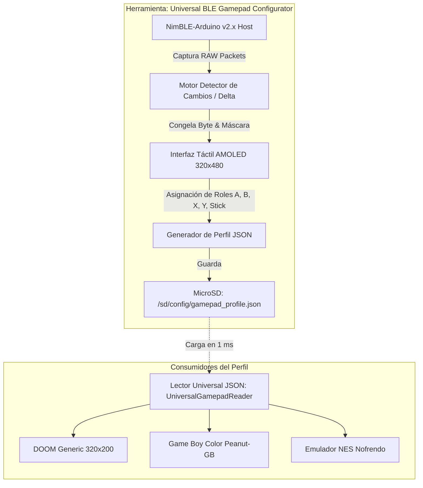

# 🎮 Especificación de Diseño: Configurador Universal de Gamepads BLE ("Learn & Assign")

**Documento de Especificación y Arquitectura Técnica**  
**Proyecto:** espOS32 — Módulo de Entrada y Calibración Inalámbrica  
**Target de Hardware:** ESP32-S3 + Pantalla AMOLED JC3248W535 (320x480) + MicroSD  

---

## 📌 1. Visión y Filosofía de Diseño

Los mandos Bluetooth comerciales y genéricos del mercado (chinos, Xbox, PlayStation, Nintendo Switch, 8BitDo, iPega, Mocute) utilizan protocolos muy dispares: algunos envían reportes HID estándar de 8 bytes, otros reportes extendidos de 17 bytes y otros funcionan en modo ratón relativo.

Intentar soportar todo mediante **"perfiles predefinidos fijos"** resulta frágil y requiere adivinar bytes manualmente cada vez que se adquiere un control nuevo.

### 💡 Principio "Learn & Assign" (Aprender y Asignar):
* **Cero adivinanzas:** El usuario presiona cualquier botón físico en su control $\rightarrow$ El sistema captura el paquete $\rightarrow$ El usuario toca en la pantalla qué función desea asignarle $\rightarrow$ Se guarda el perfil en la tarjeta MicroSD.
* **Escalabilidad Dinámica:**
  * Si el control es de **NES / SNES** (4 botones + D-Pad), se configuran únicamente 4 botones.
  * Si el control es un mando moderno de **Xbox / PS5 / Chino** (15 botones + 2 sticks analógicos), se configuran los 15.
* **Ecosistema Compartido:** El archivo generado `/sd/config/gamepad_profile.json` es leído automáticamente por **DOOM, emuladores de NES, Game Boy Color y cualquier juego futuro**.

---

## 🏗️ 2. Arquitectura del Sistema



---

## 📱 3. Diseño de la Interfaz Táctil AMOLED (Wireframe 320x480)

La pantalla se distribuye en 4 zonas ergonómicas y visuales:

```text
┌────────────────────────────────────────────────────────┐
│ 🎮 GAMEPAD CONFIGURATOR           [BT: CONECTADO 🟢]   │
│ Dispositivo: "BM769 Wireless"    MAC: 01:64:25:77:58   │
├────────────────────────────────────────────────────────┤
│ 1. PULSA CUALQUIER BOTÓN EN TU CONTROL:                │
│                                                        │
│   ┌────────────────────────────────────────────────┐   │
│   │ ⚡ ¡EVENTO CAPTURADO!                           │   │
│   │ Byte[0] = 0x03  |  Byte[1] = 0x95              │   │
│   └────────────────────────────────────────────────┘   │
├────────────────────────────────────────────────────────┤
│ 2. TOCA EN LA PANTALLA QUÉ ACCIÓN ASIGNARLE:           │
│                                                        │
│   ┌──────────────┐  ┌──────────────┐  ┌─────────────┐  │
│   │ 🟢 DISPARO/A │  │ 🔴 ABRIR/B   │  │ 🔵 ARMA/X   │  │
│   └──────────────┘  └──────────────┘  └─────────────┘  │
│   ┌──────────────┐  ┌──────────────┐  ┌─────────────┐  │
│   │ 🟡 CORRER/Y  │  │ ⬆️ ARRIBA    │  │ ⬇️ ABAJO    │  │
│   └──────────────┘  └──────────────┘  └─────────────┘  │
│   ┌──────────────┐  ┌──────────────┐  ┌─────────────┐  │
│   │ ⬅️ IZQUIERDA │  │ ➡️ DERECHA   │  │ 🔫 L1 / L2  │  │
│   └──────────────┘  └──────────────┘  └─────────────┘  │
│   ┌──────────────┐  ┌──────────────┐  ┌─────────────┐  │
│   │ 🔫 R1 / R2   │  │ ▶️ START     │  │ ⏸️ SELECT   │  │
│   └──────────────┘  └──────────────┘  └─────────────┘  │
│   ┌──────────────┐  ┌──────────────┐                   │
│   │ 🕹️ STICK L   │  │ 🎯 STICK R   │                   │
│   └──────────────┘  └──────────────┘                   │
├────────────────────────────────────────────────────────┤
│  [ 🧪 MODO PRUEBA EN VIVO ]     [ 💾 GUARDAR EN SD ]   │
└────────────────────────────────────────────────────────┘
```

---

## 💾 4. Formato Universal del Archivo de Perfil (`/sd/config/gamepad_profile.json`)

El archivo JSON almacena la información necesaria para que el motor de entrada pueda reconstruir las entradas con coste computacional mínimo ($O(1)$) en cada frame:

```json
{
  "device": {
    "name": "Gamepad-BM769",
    "mac": "01:64:25:77:58:6d",
    "report_len": 17
  },
  "buttons": {
    "PAD_A":          { "byte": 0, "mask": 1,  "mode": "bit_set" },
    "PAD_B":          { "byte": 0, "mask": 2,  "mode": "bit_set" },
    "PAD_WEAPON_NEXT":{ "byte": 1, "val": 25,  "mode": "byte_match" },
    "PAD_RUN":        { "byte": 1, "val": 45,  "mode": "byte_match" },
    "PAD_START":      { "byte": 4, "mask": 32, "mode": "bit_set" },
    "PAD_SELECT":     { "byte": 4, "mask": 16, "mode": "bit_set" }
  },
  "axes": {
    "stick_lx": { "byte": 1, "center": 128, "deadzone": 35, "is_delta": true },
    "stick_ly": { "byte": 2, "center": 128, "deadzone": 35, "is_delta": true },
    "stick_rx": { "byte": 4, "center": 128, "deadzone": 30, "is_delta": true }
  }
}
```

---

## ⚙️ 5. Mecanismo de Ingesta en Juegos (`UniversalGamepadReader.h`)

Para que los juegos no tengan sobrecarga ni dependan de librerías pesadas, el lector de perfil funciona en dos etapas:

1. **En `setup()` del juego:**
   * Abre `/sd/config/gamepad_profile.json` usando `ArduinoJson v7`.
   * Parsea el JSON a una tabla plana de structs C++ en RAM interna (`sizeof` $\approx 64$ bytes).
2. **En cada tick / frame ($35 \text{ FPS} \sim 60 \text{ FPS}$):**
   * Al recibir un paquete BLE, aplica la tabla plana directamente mediante operaciones de bits binarias (`bitwise AND / OR`), consumiendo menos de **2 microsegundos** de CPU por paquete.
   * Cuenta con un **Watchdog de Reposo:** Si transcurren más de 100 ms sin paquetes, restablece todos los botones a neutral (`0x0000`), impidiendo disparos o movimientos continuos no deseados.

---

## 🗺️ 6. Roadmap de Implementación

| Fase | Entregable | Descripción |
| :---: | :--- | :--- |
| **Fase 1** | **Estructura del Proyecto Aislado** | Crear `tools/BLEGamepadConfigurator/` con su propio `platformio.ini` independiente. |
| **Fase 2** | **Motor Delta Sniffer** | Captura automática de diferencias bit a bit al pulsar cualquier botón físico. |
| **Fase 3** | **UI Táctil AMOLED** | Panel interactivo de botones con selector de funciones y feedback visual de confirmación. |
| **Fase 4** | **Exportador MicroSD** | Generación y guardado del archivo `/sd/config/gamepad_profile.json`. |
| **Fase 5** | **Integración en Cartuchos** | `UniversalGamepadReader.h` integrado en DOOM, NES y Game Boy. |
