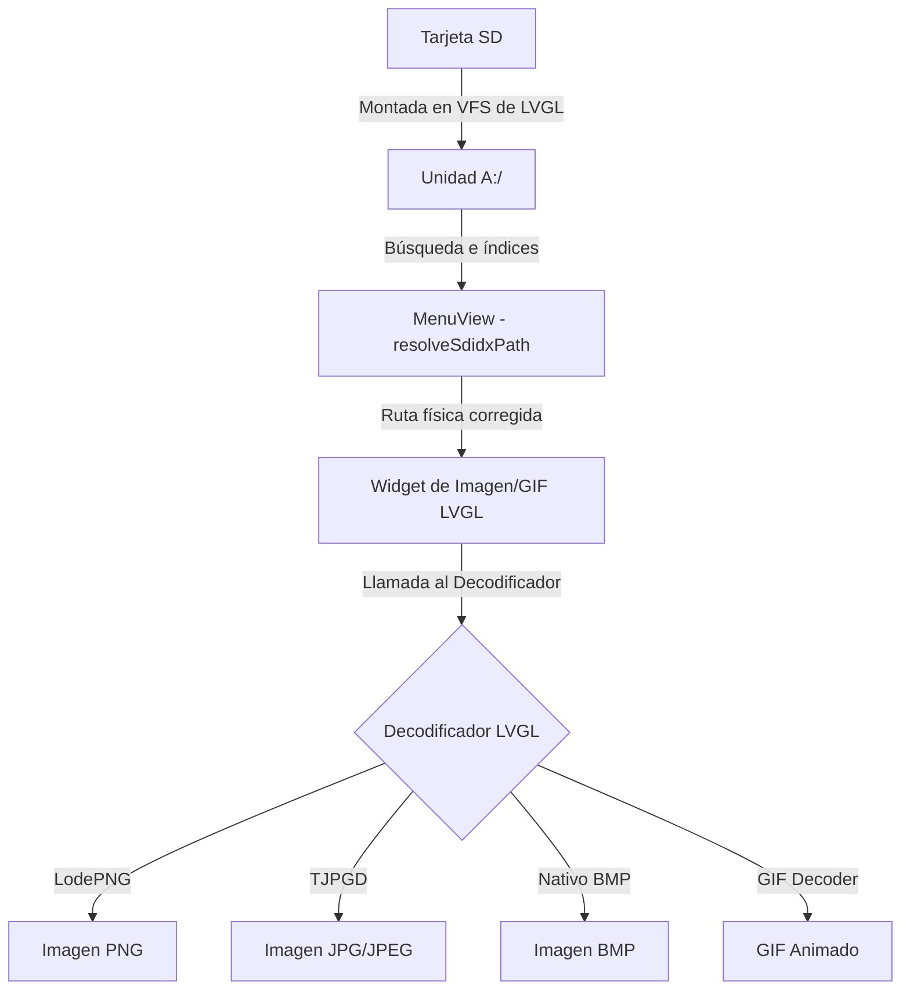

# Guía Completa de Carga de Imágenes en el Media Viewer (espOS32)

Este documento detalla el funcionamiento del sistema de carga de imágenes en **espOS32**, utilizando el hardware ESP32-S3, el sistema de archivos de la tarjeta SD montado en LVGL v9, y los decodificadores nativos de imágenes.

---

## 1. Arquitectura General de Carga de Medios

El flujo de carga de una imagen en la pantalla AMOLED/LCD del dispositivo sigue esta ruta:



---

## 2. Configuración de Decodificadores de LVGL v9 (`lv_conf.h`)

Para que LVGL pueda decodificar archivos crudos binarios de imágenes en tiempo de ejecución, es fundamental activar los módulos correspondientes en [lv_conf.h](file:///home/kaber420/Documentos/proyectos/espOS32/firmware/include/lv_conf.h).

En LVGL v9, los decodificadores de terceros (como LodePNG o Tiny JPEG Decoder) no se integran de manera global solo habilitando la extensión del visor. Deben activarse explícitamente:

### Configuración requerida en `lv_conf.h`:
```cpp
/* --- Image and GIF Decoders --- */
#define LV_USE_BMP 1          // Habilita el descodificador de archivos BMP
#define LV_USE_TJPGD 1        // Habilita Tiny JPEG Decoder (para JPG/JPEG)
#define LV_USE_GIF 1          // Habilita el widget y decodificador GIF

// ⚠️ IMPORTANTE PARA PNG EN LVGL v9:
// LVGL v9 utiliza LodePNG internamente. Definir 'LV_USE_PNG 1' no es el flag estándar en el núcleo.
// Se debe definir:
#define LV_USE_LODEPNG 1      // Habilita el decodificador oficial LodePNG para archivos PNG
```

*Nota: Asegúrate de tener `#define LV_USE_LODEPNG 1` en el archivo de cabecera de configuración para poder cargar cualquier PNG desde la tarjeta SD.*

---

## 3. Integración con el Sistema de Archivos (`LVFS_Driver.cpp`)

LVGL no puede acceder directamente a las APIs de Arduino `SD.h` sin un intermediario. Para ello, se implementó el driver en [LVFS_Driver.cpp](file:///home/kaber420/Documentos/proyectos/espOS32/firmware/src/Core/LVFS_Driver.cpp).

* **Unidad Virtual:** El driver registra la letra de unidad **`A`**.
* **Ejemplo de Rutas:**
  - Archivo en la raíz: `A:/foto.png`
  - Archivo en subcarpeta: `A:/fotos/vacaciones.jpg`

El driver (`fs_open`, `fs_read`, `fs_seek`, `fs_close`) se encarga de traducir las peticiones de LVGL a llamadas seguras de la librería `SD` de Arduino, protegiendo el bus de datos con un Mutex SPI (`lv_fs_spi_lock()` y `lv_fs_spi_unlock()`) para evitar colisiones con otras tareas (como la reproducción de audio).

---

## 4. Filtrado e Inicialización en la Interfaz (`MenuView.cpp`)

El visor de galería de medios [MenuView.cpp](file:///home/kaber420/Documentos/proyectos/espOS32/firmware/src/UI/Views/MenuView.cpp) realiza el filtrado de archivos mediante extensiones de la siguiente manera:

### Filtrado de Extensiones Admitidas
```cpp
bool isMedia = !candidate.isDirectory() &&
               (cLow.find(".mp3") != std::string::npos || cLow.find(".wav") != std::string::npos ||
                cLow.find(".jpg") != std::string::npos || cLow.find(".png") != std::string::npos ||
                cLow.find(".bmp") != std::string::npos || cLow.find(".gif") != std::string::npos);
```

### Renderizado de la Imagen (`showFullScreenImage`)
Cuando el usuario selecciona una imagen de la lista, se llama a la función `showFullScreenImage(path)`. Esta realiza los siguientes pasos:

1. **Resolver la ruta física:** Resuelve índices o nombres absolutos añadiendo el prefijo de unidad `A:/`.
2. **Crear Contenedor en Top Layer:** Crea un contenedor oscuro a pantalla completa (`lv_layer_top()`) con dimensiones de $320 \times 480$ píxeles.
3. **Instanciar el Widget:**
   - **Para GIFs:**
     ```cpp
     #if LV_USE_GIF
         img = lv_gif_create(container);
         lv_gif_set_src(img, resolved.c_str());
     #endif
     ```
   - **Para imágenes normales (PNG, JPG, BMP):**
     ```cpp
     img = lv_img_create(container);
     lv_img_set_src(img, resolved.c_str());
     ```
4. **Cierre de la Visualización:** Registra un callback del evento `LV_EVENT_CLICKED` en el contenedor. Si el usuario hace click o toca en cualquier parte de la pantalla, el contenedor completo y su imagen se destruyen de manera asíncrona mediante `lv_obj_delete_async(obj)`.

---

## 5. Consideraciones de Rendimiento y Memoria (PSRAM)

El uso de decodificadores de imágenes en microcontroladores con recursos limitados como el ESP32-S3 exige seguir pautas de optimización:

1. **Gestión de Memoria RAM:**
   * Las imágenes JPEG/PNG se decodifican en memoria RAM (buffer de píxeles). Una sola imagen de $320 \times 480$ a color de 16 bits (`RGB565`) requiere:
     $$320 \times 480 \times 2 \text{ bytes} = 307.200 \text{ bytes} \approx 307 \text{ KB de RAM}$$
   * Es vital tener activado el uso de la **PSRAM** para la asignación de buffers de LVGL (administrado por el allocator personalizado que usa `malloc`/`free` apuntando a la PSRAM).
2. **Dimensiones de la Imagen:**
   * Evita cargar imágenes de resoluciones muy grandes (ej. 4K o Full HD procedentes de cámaras de fotos o smartphones). Estas deben ser reescaladas previamente a la resolución máxima del display ($320 \times 480$ o menor) antes de transferirlas a la tarjeta SD para evitar cuelgues del sistema por desbordamiento de memoria (`Out of Memory`).
3. **Optimización de GIFs Animados:**
   * Los GIFs consumen CPU constante y memoria para almacenar los frames intermedios. Se recomienda limitar el tamaño físico de los GIFs y su tasa de FPS.
