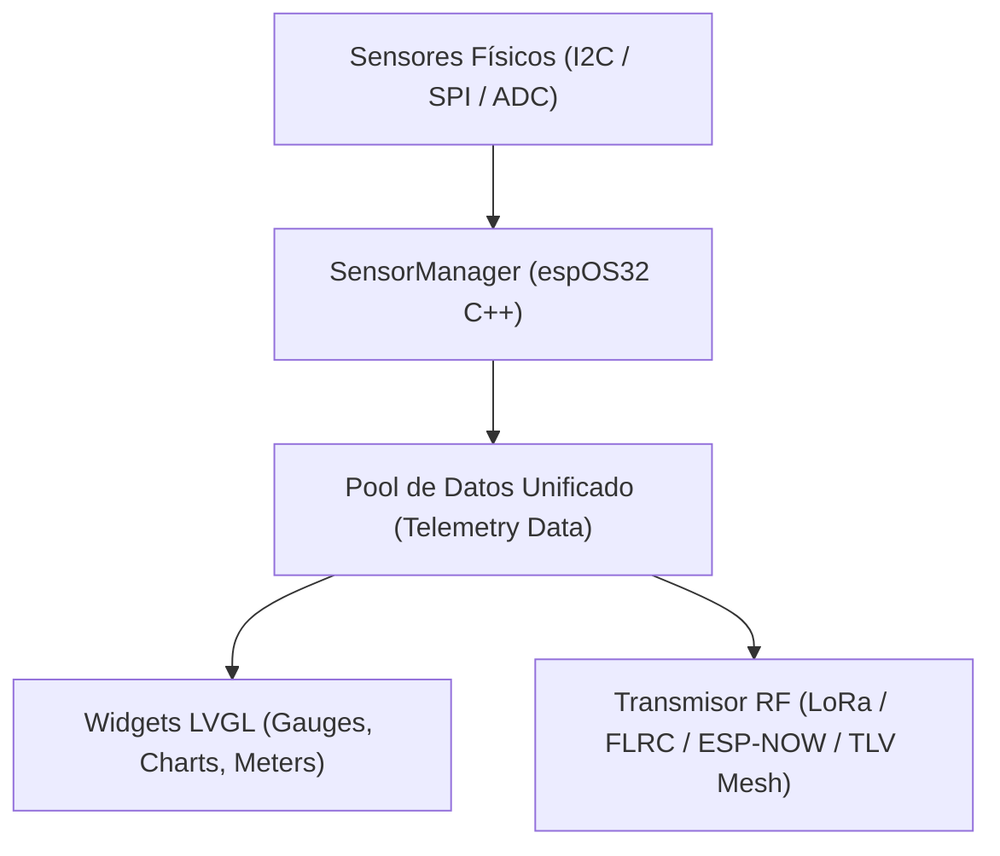

# Especificación Técnica: Controlador de GPIOs, Framework de Sensores y Telemetría para espOS32

## 1. Propósito y Visión General

El presente documento detalla la arquitectura para el módulo de **Control de Hardware, Gestión de GPIOs y Framework de Sensores** en **espOS32**.

Este sistema independiza la lógica de control del hardware de las aplicaciones específicas (como juegos o utilidades), permitiendo a espOS32 actuar como una estación de prueba, monitor de laboratorio, panel de control de domótica o nodo de telemetría remota sobre radiofrecuencia (LoRa / FLRC / ESP-NOW / TLV Mesh).

---

## 2. Subsistema 1: Controlador de GPIOs y Pines (*Pin Manager App*)

### 2.1 Funcionalidades de la GUI (LVGL v9)
* **Monitor Digital/Analógico:** Matriz interactiva de los pines libres del ESP32-S3.
* **Controladores por Pin:**
  * **Digital Output:** Toggle On/Off para relés o leds.
  * **PWM Output:** Slider dinámico para regulación de potencia, servos o dimmers.
  * **Digital Input:** Indicador LED de estado en pantalla (High / Low con pull-up/pull-down configurable).
  * **ADC Analógico:** Indicador de voltaje real (0 - 3.3V) con gráfica de lecturas continuas.

---

## 3. Subsistema 2: Framework de Plantillas de Sensores (*Sensor Hub*)

### 3.1 Bus de Sensores & Drivers (I2C / SPI / OneWire / ADC)
El sistema incluye abstracciones de drivers para autodetección y lectura de sensores comunes:

### 3.2 Catálogo de Plantillas LVGL Incluidas

| Categoría | Sensores Compatibles | Widgets LVGL Utilizados | Aplicación |
| :--- | :--- | :--- | :--- |
| **Ambiental** | BME280, SHT31, DHT22 | Arc Gauge, Labels de T/H/P, Gráfica de Tendencia (`lv_chart`) | Estación meteorológica doméstica / remota |
| **Inercial (IMU)** | MPU6050, ICM20948, LSM6DS3 | Widget 3D / Indicador de Pitch, Roll, Yaw | Inclinómetro, Nivelador, Control por gestos |
| **Energía / Batería** | INA219, Batería ADC local | Icono Status Bar, Medidor de mA/mV y % | Monitor de batería del handheld |
| **Distancia / Proximidad** | VL53L0X (ToF), HC-SR04 | Barra de progreso vertical / Alarma sonora | Medidor de distancia / Sensor de intrusión |

---

## 4. Subsistema 3: Telemetría y Transmisión por Red RF / TLV Mesh

Los datos leídos por el *Sensor Hub* se empaquetan en tramas binarias ultra ligeras para ser enviados mediante la infraestructura de red propia de **espOS32**:

1. **LoRa Telemetry Packet (Largo Alcance / Broadcast):**
   * Transmisión periódica de tramas de 8 a 16 bytes con lecturas ambientales o de batería hacia nodos receptores situados a kilómetros.
2. **FLRC / ESP-NOW Telemetry Packet (Local de Alta Velocidad):**
   * Transmisión continua a baja latencia en redes locales off-grid.
3. **TLV Mesh Gateway (TCP / Serial Binary Route):**
   * Enrutamiento de tramas TLV hacia el Gateway central del proyecto.

---

## 5. Integración con el Sistema Principal

* **Módulo:** `espOS32::HardwareManager`
* **Ubicación de Componentes:** `firmware/src/hardware/` y `firmware/src/apps/pin_manager/`
* **Persistencia:** Configuración de modos de pines (Input/Output/PWM) guardada en NVS/LittleFS.
