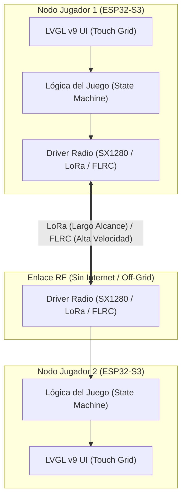
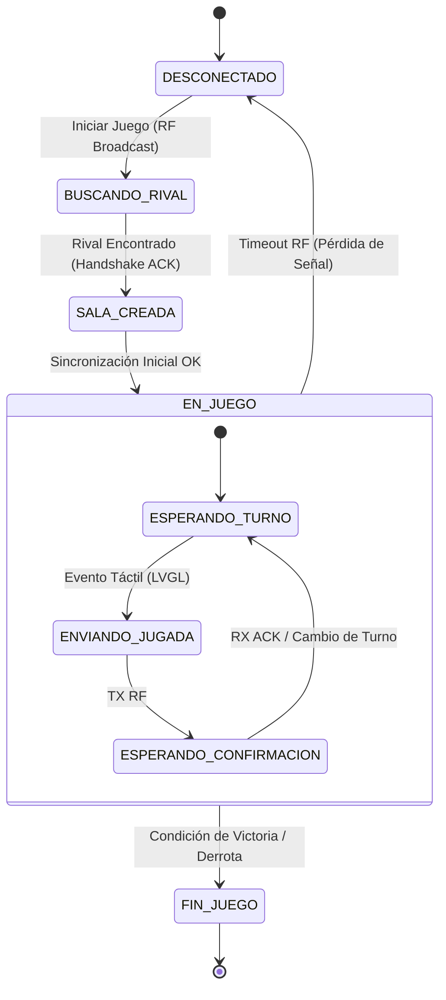

# Especificación Arquitectónica: Juegos Multijugador por RF (LoRa & FLRC) para espOS32

## 1. Visión General y Propósito

El presente documento especifica el diseño e implementación de aplicaciones de juegos multijugador distribuidos para el sistema **espOS32**, utilizando el hardware **ESP32-S3**, la interfaz gráfica **LVGL v9** y transceptores RF duales (LoRa / FLRC como el SX1280).

Debido a las marcadas diferencias físicas entre los modos **LoRa** (largo alcance, bajo ancho de banda, alta latencia) y **FLRC** (alcance medio, alto ancho de banda ~1.3 Mbps, ultra baja latencia < 5 ms), se establece una clasificación estricta de motores de juego y formatos de tramas binarias optimizadas.

---

## 2. Matriz de Clasificación de Juegos por Capa Física (PHY)

| Tipo de Juego | Capa Física | Ancho de Banda Requerido | Latencia Tolerada | Formato de Paquete | Ejemplo |
| :--- | :--- | :--- | :--- | :--- | :--- |
| **Offline / Local** | **Ninguna (Local)** | N/A (0 bps) | Inmediata (0 ms) | N/A (Sin Red) | Tetris, Snake, 3 en Raya vs BOT, Hotseat (Ajedrez 2P) |
| **Turno por Turno** | **LoRa** | ultra bajo (< 1 kbps) | Alta (200 ms - 2000 ms) | Binario Estático (3 - 8 bytes) | *Hundir la Flota (Battleship)*, Ajedrez, Damas, Conecta 4 |
| **Tiempo Real (Acción)** | **FLRC** | Medio/Alto (260 - 1300 kbps) | Ultra baja (< 15 ms) | Delta / State Stream (8 - 32 bytes @ 20Hz) | *Bomberman*, Tank Battle 2D, Snake Multijugador |

---

## 3. Arquitectura del Sistema



---

## 4. Especificación del Protocolo Binario Ligero (RF-TLVP)

Para maximizar la eficiencia y minimizar el *Airtime* de la radio, no se utiliza JSON en la capa RF. Se utiliza una estructura binaria empaquetada (`__attribute__((packed))`).

### 4.1 Encabezado Genérico de Trama RF (4 Bytes)

```c
typedef struct __attribute__((packed)) {
    uint8_t game_id;    // Identificador del juego (0x01: Battleship, 0x02: Chess, 0x10: Bomberman)
    uint8_t src_node;   // ID del nodo emisor
    uint8_t dst_node;   // ID del nodo receptor (0xFF = Broadcast)
    uint8_t msg_type;   // Tipo de mensaje (0x01: Handshake, 0x02: Move, 0x03: Ack, 0x04: Sync)
} RFGameHeader_t;
```

---

## 5. Diseño e Implementación de Juegos

### 5.1 Juego 1: Hundir la Flota (Battleship) — Optimizado para LoRa

#### Lógica del Juego
* **Tablero:** Matriz táctil $8 \times 8$ o $10 \times 10$.
* **Modo RF:** LoRa (Alcance de km sin necesidad de servidor central ni celular).
* **Flujo:** Handshake de inicio $\rightarrow$ Fase de Posicionamiento $\rightarrow$ Bucle de Disparos por Turno $\rightarrow$ Fin de Juego.

#### Estructura de Paquetes (Battleship)

```c
// Disparo de Jugador (Payload: 3 Bytes + Header: 4 Bytes = Total 7 Bytes)
typedef struct __attribute__((packed)) {
    RFGameHeader_t header; // game_id = 0x01, msg_type = 0x02
    uint8_t pos_x;         // Coordenada X (0..9)
    uint8_t pos_y;         // Coordenada Y (0..9)
    uint8_t turn_seq;      // Número de secuencia del turno
} BattleshipShotPacket_t;

// Respuesta a Disparo (Payload: 3 Bytes + Header: 4 Bytes = Total 7 Bytes)
typedef struct __attribute__((packed)) {
    RFGameHeader_t header; // game_id = 0x01, msg_type = 0x03
    uint8_t result_code;   // 0x00: Agua, 0x01: Tocado, 0x02: Hundido, 0x03: Victoria
    uint8_t ship_type;     // ID del barco hundido (si aplica)
    uint8_t turn_seq;      // Confirmación de turno
} BattleshipResultPacket_t;
```

#### Integración LVGL v9
* `lv_buttonmatrix` para el tablero de ataques y la flota propia.
* Colores dinámicos: **Azul** (Sin disparar / Agua), **Rojo** (Impacto directo), **Gris/Verde** (Barco propio).

---

### 5.2 Juego 2: Bomberman RF — Optimizado para FLRC (2.4 GHz)

#### Lógica del Juego
* **Mapa:** Grilla fija $13 \times 11$ celdas.
* **Modo RF:** FLRC (SX1280 @ 260kbps o 1.3Mbps).
* **Frecuencia de Envío:** 15 a 20 actualizaciones por segundo (cada 50 ms).

#### Estructura de Paquetes en Tiempo Real

```c
// Transmisión de Estado del Jugador (Total: 10 Bytes)
typedef struct __attribute__((packed)) {
    RFGameHeader_t header; // game_id = 0x10, msg_type = 0x02
    uint8_t pos_x;         // Coordenada Grid X (0..12)
    uint8_t pos_y;         // Coordenada Grid Y (0..10)
    uint8_t sub_offset_x;  // Sub-pixel u offset dentro de la celda (0..255)
    uint8_t sub_offset_y;  // Sub-pixel u offset dentro de la celda (0..255)
    uint8_t action_flags;  // Bit 0: Plantar Bomba, Bit 1: Dead State, Bits 2-4: Dirección
    uint8_t seq_num;       // Secuencia para detección de pérdida de tramas
} BombermanStatePacket_t;

// Transmisión de Evento de Bomba / Explosión (Total: 8 Bytes)
typedef struct __attribute__((packed)) {
    RFGameHeader_t header; // game_id = 0x10, msg_type = 0x05
    uint8_t bomb_id;       // ID único de la bomba
    uint8_t grid_x;        // Posición X
    uint8_t grid_y;        // Posición Y
    uint8_t range;         // Alcance de la explosión en celdas
} BombermanBombEvent_t;
```

#### Integración LVGL v9
* Canvas o grid de contenedores `lv_obj_t` con imágenes pequeñas o widgets acelerados por DMA/hardware.
* D-Pad virtual en pantalla táctil mediante eventos de gestos (`LV_EVENT_PRESSED`, `LV_EVENT_RELEASED`).

---

### 5.3 Juegos y Modos Offline (Sin Radio / 100% Local)

Los juegos offline permiten usar el dispositivo sin gastar batería en radios ni depender de un rival cercano.

#### 1. Modo 1 Jugador vs. BOT (IA C++ Local)
* **Hundir la Flota vs. BOT:** Algoritmo heurístico local (búsqueda aleatoria + modo caza al impactar un barco).
* **3 en Raya / Conecta 4 vs. BOT:** Algoritmo Minimax optimizado para ESP32-S3.
* **Bomberman vs. Bots (PVE):** Enemigos en mapa con lógica de movimiento en grilla y evasión básica de bombas.

#### 2. Modo Pass-and-Play / Hotseat (2 Jugadores en la Misma Pantalla)
* **Ajedrez / Damas / Conecta 4:** La interfaz de LVGL permite rotar el tablero 180° entre turnos para que dos personas jueguen cara a cara sosteniendo o apoyando la misma pantalla táctil.

#### 3. Arcade Solitario (Guardado de Récords Local)
* **Tetris / Snake / Space Invaders / Breakout:**
* Los puntajes máximos (*High Scores*) se persisten en la memoria Flash/NVS/LittleFS mediante la API de almacenamiento de **espOS32**.

---

## 6. Diagrama de Estado del Motor de Red RF



---

## 7. Hoja de Ruta para Implementación en espOS32

1. **Fase 1 (Capa de Red Abstraída):** Crear el módulo `RFGameTransport` para unificar el envio de tramas binarias sobre el driver Radio de espOS32 (LoRa / FLRC).
2. **Fase 2 (UI Base LVGL):** Implementar la plantilla de tablero táctil genérico (`lv_buttonmatrix` interactivo).
3. **Fase 3 (Juego Piloto LoRa):** Implementar *Hundir la Flota* y validar sincronización de turnos y manejo de pérdidas de paquetes.
4. **Fase 4 (Juego Piloto FLRC):** Implementar *Bomberman* en modo broadcast FLRC de alta velocidad a 20 FPS.

---

## 8. Controles y Periféricos Físicos para Juegos

Para elevar la experiencia de juego en **espOS32**, se especifican los siguientes insumos de hardware orientados a juegos:

### 8.1 Controles Físicos (Joysticks & D-Pad por GPIOs)
* **Entradas Físicas por GPIO / ADC:** Mapeo de joysticks analógicos de dos ejes o botones físicos (D-Pad) como alternativa o complemento a la pantalla táctil para juegos de respuesta rápida como *Bomberman*.

### 8.2 Giroscopio / Acelerómetro (IMU Tilt Control)
* **Control por Inclinación (MPU6050 / ICM20948):** Lectura del eje Pitch/Roll para controlar la dirección de la serpiente, mover el tanque o guiar la bolita en juegos tipo *Laberinto* inclinando el dispositivo físicamente.

### 8.3 Feedback Háptico y Sonido de Juego
* **Vibración (Motor ERM por PWM):** Pulso de vibración táctil al recibir disparos en *Hundir la Flota* o explosiones en *Bomberman*.
* **Efectos de Sonido Retro (Buzzer PWM / I2S DAC):** Efectos sonoros de 8 bits para eventos de victoria, derrotas y disparos.


