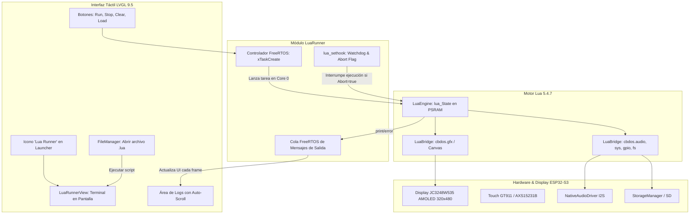

# 📜 Borrador Detallado: Fase 3 - UI Script Runner, Graphics API y Ejecución Asíncrona en CBDos

## 🎯 1. Objetivos de la Fase 3
La Fase 3 traslada el poder del motor **Lua 5.4** directamente a la pantalla táctil del ESP32-S3 mediante:
1. **Ejecución Asíncrona en FreeRTOS:** Tarea en segundo plano con control de interrupción (`lua_sethook`) para evitar bloqueos del sistema o bucles infinitos (`while true do end`).
2. **Bindings Gráficos (`cbdos.gfx`):** Primitivas de dibujo 2D (texto, líneas, rectángulos, círculos, lectura táctil) para crear mini-juegos, widgets y apps interactivas en Lua.
3. **App Terminal / Lua Runner en LVGL 9.5:** Interfaz gráfica nativa con visor de consola en vivo, botones táctiles `[ ▶ Ejecutar ]`, `[ ⏹ Detener ]`, `[ 📁 Abrir SD ]`, `[ 🧹 Limpiar ]` e integración con el Explorador de Archivos de CBDos.

---

## 🏗️ 2. Arquitectura del Sistema



---

## 🎨 3. Catálogo de la API Gráfica (`cbdos.gfx`)

Permite a los scripts dibujar directamente en un canvas o pantalla interactiva:

| Función en Lua | Parámetros | Retorno | Descripción |
| :--- | :--- | :--- | :--- |
| `cbdos.gfx.clear(color)` | `color` (hex ej: `0x000000`) | Ninguno | Limpia el canvas con un color de fondo. |
| `cbdos.gfx.draw_rect(x, y, w, h, color, filled)` | `x, y, w, h`, `color`, `filled` (bool) | Ninguno | Dibuja un rectángulo (borde o relleno). |
| `cbdos.gfx.draw_circle(x, y, r, color, filled)` | `x, y, r`, `color`, `filled` (bool) | Ninguno | Dibuja un círculo. |
| `cbdos.gfx.draw_line(x0, y0, x1, y1, color)` | `x0, y0, x1, y1, color` | Ninguno | Dibuja una línea entre dos coordenadas. |
| `cbdos.gfx.draw_text(x, y, text, color, size)` | `x, y`, `text` (string), `color`, `size` | Ninguno | Escribe texto con fuente Montserrat. |
| `cbdos.gfx.touch()` | Ninguno | `{ touched, x, y }` | Lee el estado táctil actual de la pantalla. |
| `cbdos.gfx.rgb(r, g, b)` | `r, g, b` (0 - 255) | `integer` (color) | Convierte componentes RGB a valor de color. |
| `cbdos.gfx.width()` | Ninguno | `320` | Retorna el ancho utilizable de pantalla. |
| `cbdos.gfx.height()` | Ninguno | `480` | Retorna el alto utilizable de pantalla. |

---

## 🛡️ 4. Ejecución Asíncrona Segura (No-Bloqueo de LVGL)

### A. Tarea en FreeRTOS Aislada
* Los scripts no se ejecutan en el hilo principal de LVGL (`loop()`).
* Se ejecutan en una tarea secundaria (`LuaTask`) fijada en el **Core 0** con un stack seguro de **16 KB** y memoria de variables en **PSRAM**.

### B. Hook de Interrupción y Watchdog
Para evitar que un script con `while true do` cuelgue el ESP32 o impida responder al usuario:
```cpp
// Hook ejecutado cada 1000 instrucciones de Lua
static void lua_execution_hook(lua_State* L, lua_Debug* ar) {
    if (LuaRunner::getInstance().shouldAbort()) {
        luaL_error(L, "Ejecución detenida por el usuario.");
    }
}
```

---

## 📱 5. Diseño de la Interfaz Gráfica (`LuaRunnerView`)

La vista de la aplicación constará de:

1. **Header Bar:**
   - Título con icono `[📜 Lua Script Runner]`.
   - Botón de retroceso al Launcher.
   - Badge de estado: `IDLE` (Gris), `RUNNING` (Verde pulsante), `STOPPED` (Rojo), `ERROR` (Ámbar).

2. **Panel Central de Consola:**
   - Contenedor con fondo oscuro (`0x11161B`) y borde sutil.
   - Visor de texto con scroll vertical fluido.
   - Formateo de colores por tipo de mensaje:
     - `[Lua] Mensaje normal`: Texto blanco `#E0E6ED`
     - `[OK] Éxito`: Verde `#00E676`
     - `[Error]`: Rojo coral `#FF5252`
     - `[Sistema]`: Azul celeste `#40C4FF`

3. **Barra de Acciones Inferior (Dock Táctil):**
   - Botón **▶ Ejecutar**: Inicia el script activo.
   - Botón **⏹ Detener**: Señala la bandera de aborto al hook de Lua.
   - Botón **📁 Cargar SD**: Abre un selector de archivos `.lua` desde la tarjeta SD.
   - Botón **🧹 Limpiar**: Vacía la ventana de texto de la consola.

---

## 🧪 6. Ejemplo de Mini-App / Juego en Lua para CBDos

Archivo `/sd/apps/touch_paint.lua`:
```lua
-- Mini app de dibujo táctil interactivo
print("Iniciando Touch Paint en CBDos...")
cbdos.gfx.clear(0x10141A)
cbdos.gfx.draw_text(20, 20, "Toca la pantalla para dibujar", 0x00E676, 14)

local col = cbdos.gfx.rgb(255, 200, 0)

while true do
    local t = cbdos.gfx.touch()
    if t.touched then
        cbdos.gfx.draw_circle(t.x, t.y, 8, col, true)
        cbdos.beep(1200, 15)
    end
    cbdos.delay(20) -- Cede tiempo de CPU
end
```

---

## 📋 7. Archivos a Crear y Modificar en la Fase 3

1. **`firmware/src/Core/LuaRunner.h` / `LuaRunner.cpp`:**
   - Controlador de la tarea FreeRTOS asíncrona, cola de mensajes `logQueue`, hook de interrupción y control de estado.
2. **`firmware/src/Core/LuaGfxBridge.h` / `LuaGfxBridge.cpp`:**
   - Implementación de los bindings de dibujo 2D (`cbdos.gfx.*`) sobre LVGL canvas / display driver.
3. **`firmware/src/UI/Views/LuaRunnerView.h` / `LuaRunnerView.cpp`:**
   - Pantalla interactiva en LVGL 9.5 con visor de logs y controles táctiles.
4. **Integración en `firmware/src/UI/UIManager.cpp` y `firmware/src/UI/Views/DashboardView.cpp`:**
   - Registro del icono de la aplicación en el Launcher y enlace de eventos táctiles.
