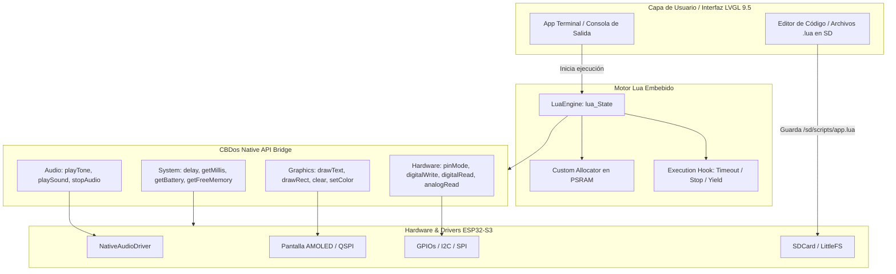

# 📜 Especificación y Borrador: Motor de Scripting Lua en CBDos

## 🎯 1. Visión General y Objetivo
Dotar a **CBDos** de un entorno de ejecución e interpretación de scripts en tiempo real utilizando **Lua 5.4**. 
Esto permitirá crear un entorno interactivo y educativo directamente en el ESP32-S3 / ESP32-P4, donde el usuario puede escribir código en un editor de texto en pantalla (o guardado en tarjeta SD) y ejecutarlo inmediatamente sin necesidad de compilar con un ordenador.

---

## ⚖️ 2. Comparativa Técnica de Lenguajes en ESP32

| Criterio | C / C++ Nativo | MicroPython | **Lua 5.4 (Propuesto)** |
| :--- | :--- | :--- | :--- |
| **Tipo de Lenguaje** | Compilado (AOT) | Interpretado (Bytecode) | **Interpretado (Bytecode al vuelo)** |
| **Requiere PC para escribir/correr** | Sí (Toolchain GCC/Clang) | No | **No** |
| **Consumo en Flash (ROM)** | 0 KB extra (Base) | 1.2 MB – 2.0 MB | **~150 KB – 200 KB** |
| **Consumo en RAM Base** | Mínimo | 150 KB – 400 KB | **~25 KB – 40 KB** |
| **Integración con C++ / LVGL** | Nativo | Compleja / Aislada | **Nativa y transparente (ANSI C)** |
| **Tiempo de arranque del motor** | N/A | 50 – 150 ms | **< 1 ms** |
| **Velocidad de ejecución** | 100% (Hardware) | ~5% - 10% | **~20% - 35% (Ultrarrápido)** |

---

## 🏗️ 3. Arquitectura del Sistema



---

## 🔌 4. Diseño del Puente de Funciones (C++ ↔ Lua)

Para que Lua pueda controlar el hardware del ESP32, se registran funciones puente en C++ dentro de la tabla global `cbdos`.

### Ejemplo de Implementación (`LuaBridge.cpp`):
```cpp
#include "lua.hpp"
#include "Core/NativeAudioDriver.h"
#include <Arduino.h>

// Función expuesta: cbdos.beep(frecuencia, duracion_ms)
static int l_cb_beep(lua_State* L) {
    int freq = luaL_checkinteger(L, 1);
    int duration = luaL_checkinteger(L, 2);
    NativeAudioDriver::playTone(freq, duration);
    return 0; // Sin valores devueltos
}

// Función expuesta: cbdos.delay(milisegundos)
static int l_cb_delay(lua_State* L) {
    int ms = luaL_checkinteger(L, 1);
    vTaskDelay(pdMS_TO_TICKS(ms));
    return 0;
}

// Función expuesta: cbdos.get_battery() -> porcentaje
static int l_cb_get_battery(lua_State* L) {
    // Ejemplo de lectura
    int pct = 85; 
    lua_pushinteger(L, pct);
    return 1; // 1 valor devuelto
}

// Registro de la librería global 'cbdos'
void register_cbdos_api(lua_State* L) {
    const luaL_Reg cbdos_funcs[] = {
        {"beep", l_cb_beep},
        {"delay", l_cb_delay},
        {"get_battery", l_cb_get_battery},
        {NULL, NULL}
    };
    luaL_newlib(L, cbdos_funcs);
    lua_setglobal(L, "cbdos");
}
```

---

## 📝 5. Ejemplo de Script que el Usuario Podría Ejecutar

Archivo guardado en la SD `/sdcard/scripts/test_alarma.lua`:

```lua
-- Script educativo para CBDos
print("--- Iniciando Script en CBDos ---")
local bateria = cbdos.get_battery()
print("Nivel de batería actual: " .. bateria .. "%")

for i = 1, 3 do
    print("Ciclo de tono: " .. i)
    cbdos.beep(880, 150) -- Tono agudo (La5)
    cbdos.delay(200)
    cbdos.beep(440, 150) -- Tono grave (La4)
    cbdos.delay(200)
end

print("--- Script finalizado con éxito ---")
```

---

## 🛡️ 6. Seguridad y Gestión de Recursos (No-Bloqueo de LVGL)

1. **Tarea FreeRTOS Dedicada (`vTaskLuaRunner`):**
   * El script corre en su propio hilo de ejecución FreeRTOS con prioridad `tskIDLE_PRIORITY + 2`.
   * Esto garantiza que el Core 1 y el bucle de renderizado de LVGL 9.5 nunca se queden congelados.
2. **Asignación de Memoria en PSRAM:**
   * Se proporciona una función de asignación de memoria personalizada a Lua (`lua_newstate(custom_alloc, NULL)`) que solicita bloques en la **PSRAM** (`heap_caps_malloc(..., MALLOC_CAP_SPIRAM)`), dejando la SRAM interna intacta.
3. **Hook de Interrupción (Botón Stop / Watchdog):**
   * Se implementa `lua_sethook(L, hook_cb, LUA_MASKCOUNT, 1000)` para detectar si el usuario presiona "Detener" en la interfaz táctil o si el script supera un tiempo máximo permitido.

---

## 🗺️ 7. Hoja de Ruta de Implementación

1. **Fase 1 (Core & Engine):** Añadir los fuentes de Lua 5.4 a `firmware/lib/lua` y validar compilación en PlatformIO.
2. **Fase 2 (CLI / Serie):** Habilitar consola interactiva REPL por el monitor serie para pruebas rápidas.
3. **Fase 3 (Hardware Bindings):** Mapear Audio (`NativeAudioDriver`), Pines GPIO, y Sensores.
4. **Fase 4 (App en UI LVGL 9.5):** Integrar un visor de consola/salida y botón "Ejecutar" en el explorador de archivos / editor de texto de CBDos.
