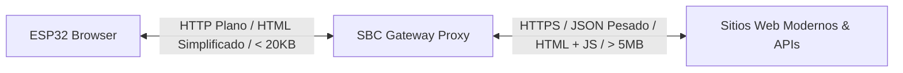

# Diseño de Arquitectura: Proxy Transcodificador Retro para ESP32

Este documento describe la arquitectura y diseño de un servidor proxy transcodificador para correr en un SBC (como Raspberry Pi u Orange Pi). Su objetivo es actuar como pasarela (gateway) entre el navegador retro del ESP32 y la web moderna, resolviendo las peticiones pesadas en el SBC y sirviendo contenido simplificado compatible con el parseador [HTMLParser](file:///home/kaber420/Documentos/proyectos/lvgl-test/src/html_parser.h) del ESP32.

---

## 1. Diagrama de Arquitectura

El flujo de información minimiza el consumo de recursos (CPU, RAM y ancho de banda) en el ESP32:



* **ESP32:** Realiza peticiones HTTP sencillas, sin la necesidad de procesar cifrados SSL pesados si se desea (o usándolos de forma básica en la red local) y sin renderizar scripts complejos.
* **SBC (Raspberry Pi / Orange Pi):** Descarga el HTML completo, procesa la estructura DOM, filtra anuncios y scripts, y re-empaqueta la información en un HTML 4.01 minimalista o JSON estructurado.

---

## 2. Endpoints del Proxy en el SBC

El servidor proxy expone tres endpoints principales optimizados para el navegador retro:

### A. Lector de Artículos (Modo Lectura)
* **Ruta:** `/read?url=<URL_COMPLETA>`
* **Función:** Descarga una noticia o artículo, ejecuta la librería `@mozilla/readability` para extraer el contenido real (título, texto principal e imágenes esenciales) y devuelve un HTML 4.01 plano.
* **Salida típica:** HTML básico con etiquetas `<h1>`, `<p>`, `` y enlaces `<a>`. Sin Javascript, CSS externo ni trackers.

### B. Portal de Clima Retro
* **Ruta:** `/clima?ciudad=<NOMBRE_DE_CIUDAD>`
* **Función:** Consulta una API pública de clima (por ejemplo, Open-Meteo) y genera al vuelo una página web HTML retro con tablas (`<table>`), colores llamativos de fondo (`bgcolor`) y una marquesina (`<marquee>`) con alertas.

### C. Lector RSS de Noticias
* **Ruta:** `/noticias` o `/noticias?feed=<URL_FEED>`
* **Función:** Parsea un archivo XML de RSS y genera una lista ordenada de hipervínculos HTML (`<a>`) apuntando al endpoint de lectura `/read?url=...` del propio proxy.

---

## 3. Implementación de Referencia (Node.js + Express)

A continuación se muestra el código base para levantar este servicio en tu SBC.

### Dependencias necesarias (`package.json`)
```json
{
  "name": "esp32-retro-proxy",
  "version": "1.0.0",
  "main": "server.js",
  "dependencies": {
    "@mozilla/readability": "^0.5.0",
    "axios": "^1.6.0",
    "express": "^4.18.2",
    "jsdom": "^22.1.0"
  }
}
```

### Código del Servidor (`server.js`)
```javascript
const express = require('express');
const axios = require('axios');
const { JSDOM } = require('jsdom');
const { Readability } = require('@mozilla/readability');

const app = express();
const PORT = 5000;

// Helper para envolver el contenido en una estructura HTML 4.01 Retro
function wrapRetroHTML(title, bodyContent, bgColor = "#FFFFFF", textColor = "#000000") {
    return `<!DOCTYPE HTML PUBLIC "-//W3C//DTD HTML 4.01 Transitional//EN">
<html>
<head>
    <meta http-equiv="Content-Type" content="text/html; charset=utf-8">
    <title>${title}</title>
</head>
<body bgcolor="${bgColor}" text="${textColor}" link="#0000EE" vlink="#551A8B" style="padding:10px; font-family:sans-serif;">
    ${bodyContent}
</body>
</html>`;
}

// 1. ENDPOINT: Modo Lectura
app.get('/read', async (req, res) => {
    const targetUrl = req.query.url;
    if (!targetUrl) {
        return res.send(wrapRetroHTML("Error", "<h1>Error</h1><p>Falta el parámetro 'url' en la consulta.</p>", "#FFDDDD", "#000000"));
    }

    try {
        console.log(`[Proxy] Procesando modo lectura para: ${targetUrl}`);
        const response = await axios.get(targetUrl, {
            headers: { 'User-Agent': 'Mozilla/5.0 (Windows NT 10.0; Win64; x64)' },
            timeout: 10000
        });

        // Cargar HTML en un DOM virtual para procesar heurísticas
        const dom = new JSDOM(response.data, { url: targetUrl });
        const reader = new Readability(dom.window.document);
        const article = reader.parse();

        if (!article) {
            throw new Error("No se pudo extraer contenido legible.");
        }

        // Limpiar elementos no deseados del artículo que readability pudiera haber dejado (e.g. iframes)
        const cleanContent = article.content
            .replace(/<iframe[^>]*>([\s\S]*?)<\/iframe>/gi, '')
            .replace(/<script[^>]*>([\s\S]*?)<\/script>/gi, '')
            .replace(/style="[^"]*"/gi, ''); // Eliminar estilos CSS inline modernos si molestan al parser

        const body = `
            <center>
                <h1>${article.title}</h1>
                <p><i>Por: ${article.byline || 'Desconocido'}</i></p>
                <hr>
            </center>
            <div>
                ${cleanContent}
            </div>
            <hr>
            <center>
                <p><a href="/noticias">Volver al Portal de Noticias</a></p>
            </center>
        `;

        res.send(wrapRetroHTML(article.title, body, "#FDF6E3", "#002B36")); // Colores sepia estilo papel
    } catch (error) {
        console.error(error);
        res.send(wrapRetroHTML("Error de Lectura", `<h1>Error de Transcodificación</h1><p>${error.message}</p>`, "#FFDDDD", "#550000"));
    }
});

// 2. ENDPOINT: Clima Retro (Genera tablas HTML compatibles con la Fase 3 del Navegador)
app.get('/clima', async (req, res) => {
    const ciudad = req.query.ciudad || 'Madrid';
    try {
        // Ejemplo de llamada a Open-Meteo para obtener temperatura actual
        // Para simplificar, buscamos coordenadas aproximadas o fijas. En producción puedes integrar geocoding.
        const weatherRes = await axios.get(`https://api.open-meteo.com/v1/forecast?latitude=40.4168&longitude=-3.7038&current_weather=true&daily=temperature_2m_max,temperature_2m_min,weathercode&timezone=Europe%2FMadrid`);
        
        const current = weatherRes.data.current_weather;
        const daily = weatherRes.data.daily;

        const body = `
            <center>
                <table border="0" bgcolor="#000080" width="100%">
                    <tr>
                        <td>
                            <center><font color="#FFFFFF" size="6"><b>METEO-RETRO 98</b></font></center>
                        </td>
                    </tr>
                </table>
                <marquee bgcolor="#FFFF00" text="#000000"><b>ALERTA METEOROLÓGICA:</b> No se registran alertas importantes para el día de hoy.</marquee>
                
                <h2>Condición Actual en ${ciudad}</h2>
                <table border="1" cellpadding="8" bgcolor="#FFFFFF" text="#000000">
                    <tr bgcolor="#EFEFEF">
                        <td><b>Temperatura</b></td>
                        <td><font size="5" color="#FF0000"><b>${current.temperature} °C</b></font></td>
                    </tr>
                    <tr>
                        <td><b>Viento</b></td>
                        <td>${current.windspeed} km/h</td>
                    </tr>
                </table>

                <h3>Pronóstico Semanal</h3>
                <table border="1" cellpadding="4" bgcolor="#FFFFFF" text="#000000" width="90%">
                    <tr bgcolor="#000080">
                        <th><font color="#FFFFFF">Día</font></th>
                        <th><font color="#FFFFFF">Mín (°C)</font></th>
                        <th><font color="#FFFFFF">Máx (°C)</font></th>
                    </tr>
                    ${daily.time.map((time, idx) => `
                    <tr>
                        <td><b>${time}</b></td>
                        <td>${daily.temperature_2m_min[idx]}</td>
                        <td><font color="#CC0000">${daily.temperature_2m_max[idx]}</font></td>
                    </tr>
                    `).join('')}
                </table>
                <br>
                <hr>
                <p><a href="/">Menú Principal</a></p>
            </center>
        `;

        res.send(wrapRetroHTML(`Clima - ${ciudad}`, body, "#E6E6FA", "#000000"));
    } catch (error) {
        res.send(wrapRetroHTML("Error del Clima", `<h1>Error Meteorológico</h1><p>${error.message}</p>`, "#FFDDDD", "#000000"));
    }
});

// 3. ENDPOINT: Noticias Portada (Feed RSS simplificado)
app.get('/noticias', async (req, res) => {
    // Feed RSS de prueba (e.g. tecnología de El País o similar)
    const rssUrl = 'https://feeds.elpais.com/mrss-s/pages/ep/site/elpais.com/section/tecnologia/portada';
    
    try {
        const response = await axios.get(rssUrl);
        // Analizador XML básico usando regex para evitar librerías pesadas en este borrador
        const xml = response.data;
        const items = [];
        const itemRegex = /<item>([\s\S]*?)<\/item>/g;
        let match;

        while ((match = itemRegex.exec(xml)) !== null && items.length < 10) {
            const content = match[1];
            const title = (/<title><!\[CDATA\[([\s\S]*?)\]\]><\/title>/i.exec(content) || /<title>([\s\S]*?)<\/title>/i.exec(content) || ["", "Sin título"])[1];
            const link = (/<link>([\s\S]*?)<\/link>/i.exec(content) || ["", ""])[1].trim();
            items.push({ title, link });
        }

        const listItems = items.map((item, idx) => `
            <p>
                <b>[${idx + 1}]</b> 
                <a href="/read?url=${encodeURIComponent(item.link)}">${item.title}</a>
            </p>
        `).join('<hr>');

        const body = `
            <center>
                <table border="0" bgcolor="#800000" width="100%">
                    <tr><td><center><font color="#FFFFFF" size="5"><b>DIARIO RETRO: TECNOLOGÍA</b></font></center></td></tr>
                </table>
                <br>
            </center>
            <div style="background-color:#FFF8DC; border: 2px solid #800000; padding:10px; text-color:#000;">
                ${listItems}
            </div>
            <br>
            <center><p><a href="/">Menú Principal</a></p></center>
        `;

        res.send(wrapRetroHTML("Noticias Tecnológicas", body, "#FFF8DC", "#000000"));
    } catch (error) {
        res.send(wrapRetroHTML("Error Noticias", `<h1>Error al Cargar Noticias</h1><p>${error.message}</p>`, "#FFDDDD", "#000000"));
    }
});

// Menú Principal por defecto
app.get('/', (req, res) => {
    const body = `
        <center>
            <h1>Portal Gateway Retro</h1>
            <p>Servidor Proxy de Transcodificación Web Activo</p>
            <hr>
            <table border="1" cellpadding="10" bgcolor="#E0E0E0">
                <tr>
                    <td><a href="/clima?ciudad=Madrid"><b>[1] Servicio del Clima</b></a></td>
                </tr>
                <tr>
                    <td><a href="/noticias"><b>[2] Portal de Noticias</b></a></td>
                </tr>
            </table>
            <br>
            <p>Navegador Cliente: ESP32-S3/P4</p>
        </center>
    `;
    res.send(wrapRetroHTML("Retro Portal", body, "#008080", "#FFFFFF"));
});

app.listen(PORT, () => {
    console.log(`[Proxy] Servidor corriendo en http://localhost:${PORT}`);
});
```

---

## 4. Integración en el Firmware del ESP32

Para navegar a través de este proxy, en el código del ESP32 ([browser.cpp](file:///home/kaber420/Documentos/proyectos/lvgl-test/src/browser.cpp)):

1. Configura una variable de configuración global para la IP de tu SBC proxy (por ejemplo, en `config.h`):
   ```cpp
   #define SBC_PROXY_HOST "192.168.1.100"
   #define SBC_PROXY_PORT "5000"
   ```

2. Si el usuario escribe una URL externa directamente en la barra de direcciones y tienes habilitado el "Modo Lectura" en la interfaz del navegador, puedes interceptarla antes de lanzar la tarea HTTP:
   ```cpp
   std::string final_url;
   if (modo_lectura_activo) {
       final_url = "http://" + std::string(SBC_PROXY_HOST) + ":" + std::string(SBC_PROXY_PORT) + "/read?url=" + url_solicitada;
   } else {
       final_url = url_solicitada;
   }
   ```

3. El fetcher descargará la versión optimizada generada por tu SBC. Dado que las etiquetas y atributos como `bgcolor`, `align`, `width`, `border`, e incluso CSS inline `style` (planificados en tu Fase 1 y Fase 3) son soportados por el proxy, la página se renderizará de forma impecable y con total coherencia retro en LVGL.
