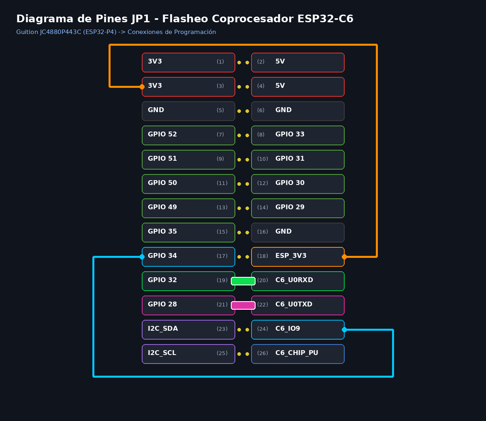

# Guía de Flasheo: Coprocesador ESP32-C6 (SDIO Slave)

Esta guía explica paso a paso cómo programar el coprocesador **ESP32-C6** en la placa **Guition JC4880P443C (JC-ESP32P4-M3)** utilizando el puente serie del **ESP32-P4**.

---

## 📋 Resumen del Mapeo de Cabecera JP1 (2×13)

```text
       COLUMNA IZQUIERDA              COLUMNA DERECHA
       ─────────────────              ───────────────
[Pin 1]   3V3 (Alimentación)     │  [Pin 2]   5V
[Pin 3]   3V3 (Alimentación)     │  [Pin 4]   5V
[Pin 5]   GND                    │  [Pin 6]   GND
[Pin 7]   GPIO52                 │  [Pin 8]   GPIO33
[Pin 9]   GPIO51                 │  [Pin 10]  GPIO31
[Pin 11]  GPIO50                 │  [Pin 12]  GPIO30
[Pin 13]  GPIO49                 │  [Pin 14]  GPIO29
[Pin 15]  GPIO35                 │  [Pin 16]  GND (Tierra)
[Pin 17]  GPIO34                 │  [Pin 18]  ESP_3V3 (Poder C6)
[Pin 19]  GPIO32 ───────────────┼──[Pin 20]  C6_U0RXD
[Pin 21]  GPIO28 ───────────────┼──[Pin 22]  C6_U0TXD
[Pin 23]  I2C_SDA                │  [Pin 24]  C6_IO9 (Boot C6)
[Pin 25]  I2C_SCL                │  [Pin 26]  C6_CHIP_PU (Reset C6)
```



---

## 🔌 1. Conexiones Físicas de Cables / Jumpers en JP1

Para flashear el C6 se requieren las siguientes conexiones:

| Cable / Jumper | De (Origen / Lado Izq) | A (Destino / Lado Der) | Función |
| :--- | :--- | :--- | :--- |
| 🟧 **Cable Naranja:** | `3V3` (Pin 3) | `ESP_3V3` (Pin 18) | Alimenta eléctricamente el C6 (3.3V) |
| 🟩 **Jumper Verde (Horizontal):** | `GPIO 32` (Pin 19) | `C6_U0RXD` (Pin 20) | Canal de datos TX del P4 ➔ RX del C6 |
| 🟪 **Jumper Magenta (Horizontal):** | `GPIO 28` (Pin 21) | `C6_U0TXD` (Pin 22) | Canal de datos RX del P4 🠄 TX del C6 |
| 🟦 **Cable Celeste (Modo BOOT):** | `GPIO 34` (Pin 17) | `C6_IO9` (Pin 24) | Control automático de entrada a Bootloader |

> ℹ️ **Control de Reset (CHIP_PU):** La línea `C6_CHIP_PU` (Pin 26) está conectada **internamente en la placa PCB al GPIO 54 del ESP32-P4**. Esto permite resetear el coprocesador de forma controlada por software sin necesidad de un jumper manual en el pin 26.

---

## 🚀 2. Procedimiento de Flasheo Paso a Paso

### Paso A: Grabar el Puente Flasher en el ESP32-P4
Primero, grabamos el firmware puente en el ESP32-P4 para que redirija los datos del USB hacia el C6:
```bash
cd tools/c6_flasher_bridge
idf.py -p /dev/ttyACM0 flash
```

### Paso B: Poner el C6 en Modo Bootloader
1. Conecta los cables 1, 2 y 3.
2. Toca el **Cable 4 (`C6_IO9` a `GND`)** durante 2 segundos para forzar el arranque en modo descarga ROM.
3. Puedes retirar el Cable 4 tras esos 2 segundos (o dejarlo puesto durante el flasheo).

### Paso C: Grabar el Firmware SDIO al ESP32-C6
Ejecuta el script de flasheo con múltiples reintentos de sincronización:
```bash
python -m esptool --chip esp32c6 -p /dev/ttyACM0 -b 115200 --connect-attempts 30 --before no_reset write_flash 0x0 /home/kaber420/Documentos/proyectos/cbdos/bsp/esp32_c6_slave/build/network_adapter.bin
```

---

## 🧹 3. Limpieza Posterior (Modo Operativo Normal)

Una vez completado el flasheo al 100%:

1. **QUITA** el Jumper de `GPIO 32` a `C6_U0RXD`.
2. **QUITA** el Jumper de `GPIO 28` a `C6_U0TXD`.
3. **QUITA** el Cable de `C6_IO9` a `GND` (para que el C6 arranque en modo normal).
4. **DEJA CONECTADO ÚNICAMENTE** el cable de **`3V3` a `ESP_3V3`** (para que el C6 tenga corriente eléctrica).
5. Vuelve a flashear **CBDos** en el ESP32-P4:
   ```bash
   cd bsp/esp32_p4_jc4880
   idf.py -p /dev/ttyACM0 flash
   ```

---

## 🎯 Verificación
* En CBDos, entra a **Ajustes ➔ Wi-Fi**.
* Activa el interruptor **"Activar Wi-Fi"** e ingresa tus credenciales.
* El P4 se comunicará con el C6 a través del bus interno **SDIO 4-bit** a 20 MHz.
